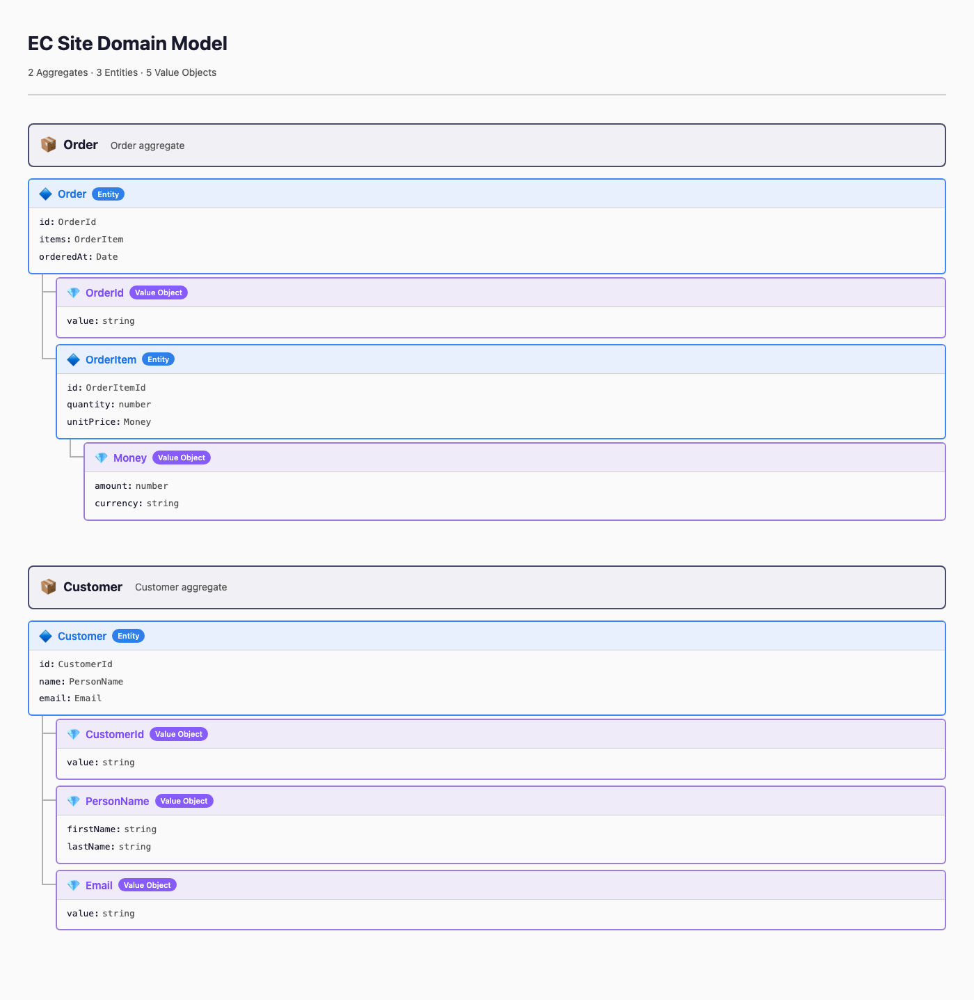

# domaintree

A CLI tool that takes DDD domain model definitions (YAML) and renders them as a
single self-contained HTML file with a file-tree-style layout.



## Features

- Visualize DDD domain models (Entity, Value Object)
- Automatically infer aggregate boundaries from model relationships
- Single HTML file output (inline CSS, no external dependencies)
- Dark mode / light mode support (`prefers-color-scheme`)
- Cross-runtime: works with Node.js, Deno, and Bun

## Usage

```bash
# Build HTML from YAML (output to a file)
npx domaintree build domains.yaml -o output.html

# Output to stdout
npx domaintree build domains.yaml > output.html

# Print the expected input schema as JSON Schema
npx domaintree types
```

With Deno:

```bash
dx domaintree build domains.yaml -o output.html
dx domaintree types
```

### Commands

| Command                   | Description                                      |
| ------------------------- | ------------------------------------------------ |
| `build <input.yaml>`      | Build HTML from a YAML domain model file         |
| `types`                   | Print the expected input schema as JSON Schema   |

### Options (build)

| Option                | Default   | Description        |
| --------------------- | --------- | ------------------ |
| `-o, --output <path>` | stdout    | Output file path   |
| `--title <title>`     | from YAML | Override the title |

## Input Format

Define models in a flat list — the tool automatically infers aggregate
boundaries from property type references.

```yaml
title: "EC Site Domain Model"

models:
  - name: Order
    type: entity
    description: "Order aggregate"
    properties:
      - name: id
        type: OrderId
      - name: items
        type: OrderItem

  - name: OrderItem
    type: entity
    properties:
      - name: quantity
        type: number
      - name: unitPrice
        type: Money

  - name: Money
    type: value_object
    properties:
      - name: amount
        type: number
      - name: currency
        type: string

  - name: OrderId
    type: value_object
    properties:
      - name: value
        type: string
```

Run `npx domaintree types` (or `dx domaintree types`) to get the full JSON
Schema. See [spec.md](./spec.md) for the schema definition.

## Development

```bash
# Run tests
deno test --allow-read --allow-env --allow-run

# Format
deno fmt

# Lint
deno lint
```

## License

MIT
