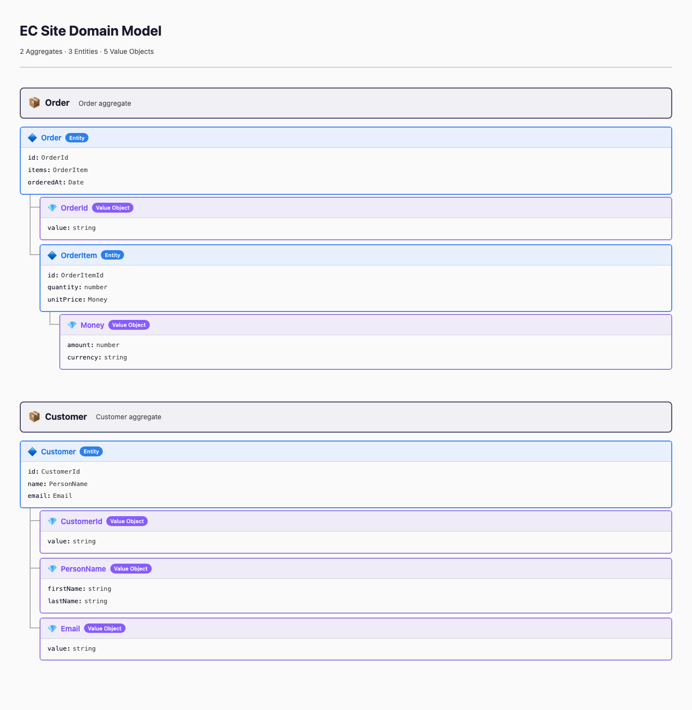

# domainchart

A CLI tool that takes DDD domain model definitions (JSON) and renders them as a
single self-contained HTML file with a file-tree-style layout.



## Features

- Visualize DDD domain models (Entity, Value Object)
- Automatically infer aggregate boundaries from model relationships
- Single HTML file output (inline CSS, no external dependencies)
- Dark mode / light mode support (`prefers-color-scheme`)
- Cross-runtime: works with Node.js, Deno, and Bun

## Usage

```bash
# Build HTML from JSON (output to a file)
npx domainchart build domains.json -o output.html

# Output to stdout
npx domainchart build domains.json > output.html

# Print the expected input schema as JSON Schema
npx domainchart types

# Validate an input file against the schema
npx domainchart validate domains.json
```

With Deno:

```bash
dx domainchart build domains.json -o output.html
dx domainchart types
```

### Commands

| Command                 | Description                                    |
| ----------------------- | ---------------------------------------------- |
| `build <input.json>`    | Build HTML from a JSON domain model file       |
| `types`                 | Print the expected input schema as JSON Schema |
| `validate <input.json>` | Validate a JSON input file against the schema  |

### Options (build)

| Option                | Default   | Description        |
| --------------------- | --------- | ------------------ |
| `-o, --output <path>` | stdout    | Output file path   |
| `--title <title>`     | from JSON | Override the title |

## Input Format

Define models in a flat list — the tool automatically infers aggregate
boundaries from property type references.

```json
{
  "title": "EC Site Domain Model",
  "models": [
    {
      "name": "Order",
      "kind": "entity",
      "description": "Order aggregate",
      "properties": [
        { "name": "id", "type": "OrderId" },
        { "name": "items", "type": "OrderItem" }
      ]
    },
    {
      "name": "OrderItem",
      "kind": "entity",
      "properties": [
        { "name": "quantity", "type": "number" },
        { "name": "unitPrice", "type": "Money" }
      ]
    },
    {
      "name": "Money",
      "kind": "value_object",
      "properties": [
        { "name": "amount", "type": "number" },
        { "name": "currency", "type": "string" }
      ]
    },
    {
      "name": "OrderId",
      "kind": "value_object",
      "properties": [
        { "name": "value", "type": "string" }
      ]
    }
  ]
}
```

Each model has a `kind` (`entity` or `value_object`), while each property has a
`type` (either a primitive name or another model's name — used to infer
parent-child relationships).

Run `npx domainchart types` (or `dx domainchart types`) to get the full JSON
Schema. See [spec.md](./spec.md) for the schema definition.

## Development

```bash
# Run tests in Deno
deno test --allow-read --allow-env --allow-run
# Run tests in Node
npx deno-test

# Format
deno fmt

# Lint
deno lint
```

## License

MIT
